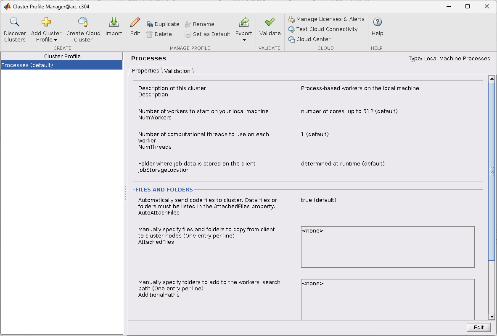

Submitting jobs using the MATLAB Parallel Server
================================================

MATLAB Parallel Server (MPS) allows you to create and use parallel pools that can scale to many CPUs more than in a single node. Currently MPS jobs must be submitted 
from a GUI or command line MATLAB session running on one of the ARC Graphical (NX) nodes or a session on an interactive node. You **must not** run MPS from a cluster 
login node.

We have generated a basic cluster profile definition file for each cluster ARC and HTC. 

Importing cluster profiles
==========================

You need to import the ARC or HTC cluster profile into your MATLAB environment and set it as the default before you can submit MPS jobs. 

This only needs doing once. The imported profile will be saved in your MATLAB settings directory.

Importing the profile can be done either by calling MATLAB functions or via the graphical interface. The profiles are stored here (for R2022b)::

  /apps/common/commercial/MATLAB/mps_profiles/R2022b

The profiles are configured for specific partitions or resources, as follows:

+--------------------+-----------------------+-----------------------+
| Partition/Resource | ARC                   | HTC                   |
+--------------------+-----------------------+-----------------------+
| devel              | arc_devel.mlsettings  | htc_devel.mlsettings  |
+--------------------+-----------------------+-----------------------+
| short              | arc_short.mlsettings  | htc_short.mlsettings  |
+--------------------+-----------------------+-----------------------+
| medium             | arc_medium.mlsettings | htc_medium.mlsettings |     
+--------------------+-----------------------+-----------------------+

Importing cluster profile directly from MATLAB GUI
==================================================

For these examples we will use the ``arc_devel`` profile.

To import using the graphical interface:

From the MATLAB Home tab select the ``Parallel`` menu and click ``Create and Manage Clusters...`` The **Cluster Profile Manager** window will open:

  
  
Select ``Import`` and from within the ``Import Profiles from file`` window navigate to the ``arc_devel.mlsettings`` file described
above and select ``Open``

Select the resulting ``arc_devel`` profile and click ``Set as Default``. 

The Cluster Profile Manager window should now look like this: 

.. image:: ../images/arc-cluster2.png
   :width: 800
   :alt: Cluster Imported

.. note::
   After you exit MATLAB, your default cluster profile is saved for future use.
   
To test the loaded profile, click the ``Validate`` button and the validation process will begin. Once the process completes the screen should look as follows:

.. image:: ../images/arc-cluster3.png
   :width: 800
   :alt: Cluster Validation
   
   
Import using MATLAB functions
=============================

Instead of selecting and activating the cluster profile from the GUI you can run these functions from a command line MATLAB session::

   arc_profile = parallel.importProfile ('/apps/common/commercial/MATLAB/mps_profiles/R2022b/arc_devel.mlsettings');
   parallel.defaultClusterProfile ('arc_devel');
   
The above could be used as part of a MATLAB script. See next example...

Full MPS Example
================

In this example we are going to use the ``arc_short`` partition. So, follow the instructions above to load the file named ``arc_short.mlsettings``

Once this is loaded. From the MATLAB GUI click ``New Script`` and paste the following script into the editor::

  %
  % ARC Parallel MATLAB example
  %
  % Either have arc-short cluster profile set as default in GUI or uncomment the 
  % following two lines:
  %
  %parprof = parallel.importProfile("/apps/common/commercial/MATLAB/mps_profiles/R2022b/arc_short.mlsettings")
  %parallel.defaultProfile(parprof)

  primeNumbers = primes(uint64(2^20));
  compositeNumbers = primeNumbers.*primeNumbers(randperm(numel(primeNumbers)));
  factors = zeros(numel(primeNumbers),2);

  % Create parallel pool
  %
  poolObj=parpool('arc_short',96);

  numWorkers = [1 24 48 72 96];
  tCluster = zeros(size(numWorkers));

  for w = 1:numel(numWorkers)
      tic;
      parfor (idx = 1:numel(compositeNumbers), numWorkers(w))
          factors(idx,:) = factor(compositeNumbers(idx));
      end
      tCluster(w) = toc;
  end

  % Shutdown parallel pool.
  delete(poolObj);

  f = figure;
  figure(f);
  hold on
  speedup = tCluster(1)./tCluster;
  plot(numWorkers, speedup);
  title('Speedup with the number of workers');
  xlabel('Number of workers');
  xticks(numWorkers(2:end));
  ylabel('Speedup');
  
Once you have done this, click "Run" from the Editor. The script will start a job in the ARC short queue, and use this as a MATLAB worker pool. If the job is able to run immediately (remember it may be queued for a while if the cluster is busy) - the run time is around 5 minutes and you should be presented with the following plot when it completes:

